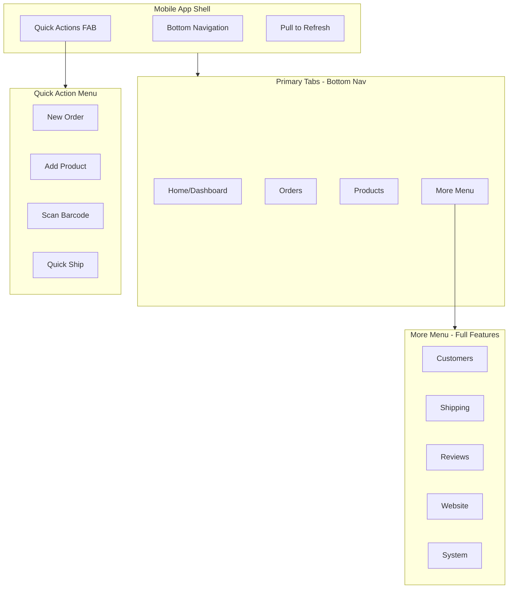

<!-- b4b59981-bf3a-4765-b9ec-e5e8a070ca20 2d3ecf4a-bb16-4010-9ec1-778caef77016 -->
# Mobile Admin Panel App-Like Experience

## Overview

Transform the mobile admin panel into a native app-like experience optimized for on-the-go store management. The mobile view will serve as a **Mobile Command Center** for Kind Kandles, prioritizing order management and product management while keeping all features accessible.

## Architecture



## Design Principles

1. **Thumb-Friendly Navigation** - Bottom tab bar within easy reach
2. **Glanceable Information** - Key metrics visible at a glance
3. **Quick Actions** - Common tasks accessible in 1-2 taps
4. **Offline-Ready UI** - Graceful handling of connectivity issues
5. **Native Feel** - Smooth animations, haptic feedback patterns, swipe gestures

## Implementation Plan

### Phase 1: Mobile Detection and Shell

**1.1 Create Mobile Detection Hook**

Create `src/hooks/useMobileDetect.ts`:

- Detect mobile viewport (< 768px)
- Detect touch device capability
- Provide `isMobile`, `isTablet`, `isTouch` flags
- Handle orientation changes

**1.2 Create Mobile App Shell Component**

Create `src/components/admin/mobile/MobileAppShell.tsx`:

- Wrap entire admin panel on mobile
- Manage bottom navigation state
- Handle safe area insets (notch, home indicator)
- Provide app-like status bar styling

### Phase 2: Bottom Tab Navigation

**2.1 Create Bottom Tab Bar Component**

Create `src/components/admin/mobile/BottomTabBar.tsx`:

- Fixed bottom position with safe area padding
- 4 primary tabs: Home, Orders, Products, More
- Active state with icon fill and label
- Badge indicators for pending orders/alerts
- Haptic feedback on tap (where supported)

**2.2 Tab Configuration**

```
Tab 1: Home (Dashboard)
  - Icon: BarChart3
  - Shows: Quick stats, recent activity, alerts

Tab 2: Orders (Primary Focus)
  - Icon: ShoppingCart
  - Badge: Pending order count
  - Shows: Order list with quick filters

Tab 3: Products (Primary Focus)
  - Icon: Package
  - Shows: Product list with quick edit

Tab 4: More
  - Icon: Menu/Grid
  - Shows: Full feature menu grid
```

### Phase 3: Mobile-Optimized Home Dashboard

**3.1 Create Mobile Dashboard Component**

Create `src/components/admin/mobile/MobileDashboard.tsx`:

- Compact stat cards (2x2 grid)
- Today's summary: Orders, Revenue, Pending
- Quick action buttons row
- Recent orders list (last 5)
- Alerts/notifications section
- Pull-to-refresh functionality

**3.2 Key Metrics Display**

- Orders Today (with trend indicator)
- Revenue Today
- Pending Orders (tap to view)
- Low Stock Alerts

### Phase 4: Mobile Orders View

**4.1 Create Mobile Orders Component**

Create `src/components/admin/mobile/MobileOrders.tsx`:

- Segmented control: All | Pending | Shipped | Delivered
- Swipeable order cards with quick actions
- Swipe right: Mark shipped
- Swipe left: View details
- Pull-to-refresh
- Infinite scroll pagination
- Search bar with voice input option

**4.2 Order Card Design**

- Customer name + order number
- Order total prominently displayed
- Status badge (color-coded)
- Time since order (relative)
- Quick action buttons: Ship, View, Contact

**4.3 Quick Ship Flow**

Create `src/components/admin/mobile/QuickShipModal.tsx`:

- Streamlined shipping label creation
- Pre-filled from order data
- One-tap carrier selection
- Confirm and print/email label

### Phase 5: Mobile Products View

**5.1 Create Mobile Products Component**

Create `src/components/admin/mobile/MobileProducts.tsx`:

- Grid view (2 columns) with product images
- List view option toggle
- Quick stock update (tap quantity)
- Search with filters dropdown
- Sort by: Recent, Stock, Price
- Pull-to-refresh

**5.2 Product Card Design**

- Product image (square thumbnail)
- Title (truncated)
- Price
- Stock indicator (green/yellow/red)
- Quick edit button

**5.3 Quick Edit Modal**

Create `src/components/admin/mobile/QuickEditProduct.tsx`:

- Edit price inline
- Update stock quantity
- Toggle active/inactive
- Save with single tap

### Phase 6: More Menu (Full Features)

**6.1 Create More Menu Component**

Create `src/components/admin/mobile/MoreMenu.tsx`:

- Grid layout of all features (3 columns)
- Icon + label for each section
- Grouped by category with headers
- Search/filter for features
- Recent/favorites section at top

**6.2 Feature Grid Layout**

```
STORE
[Customers] [Shipping] [Reviews]
[Discounts] [Fulfillment]

WEBSITE  
[Promotions] [Blog] [Email]
[Menu] [Files] [Featured]

ENGAGEMENT
[Contacts] [Survey] [Stories]

SYSTEM
[Settings] [Admin] [AI Assistant]
```

### Phase 7: Quick Actions FAB

**7.1 Create Floating Action Button**

Create `src/components/admin/mobile/QuickActionsFAB.tsx`:

- Floating button (bottom right, above tab bar)
- Expands to show quick actions on tap
- Actions: New Order, Add Product, Quick Ship, Scan
- Animated expand/collapse
- Backdrop blur when open

### Phase 8: Gestures and Interactions

**8.1 Swipe Gestures**

- Swipe down: Pull to refresh (all lists)
- Swipe right on order: Quick ship action
- Swipe left on order: Delete/archive
- Swipe between tabs (optional)

**8.2 Haptic Feedback**

Create `src/lib/haptics.ts`:

- Light tap for button presses
- Medium for successful actions
- Heavy for destructive actions
- Pattern for notifications

**8.3 Animations**

- Tab switch transitions
- Card enter/exit animations
- Modal slide-up presentations
- Loading skeleton states

### Phase 9: Mobile-Specific Features

**9.1 Notification Badge System**

- Real-time order count on Orders tab
- Alert indicator on Home tab
- Sync with actual pending counts

**9.2 Offline Indicator**

- Show banner when offline
- Queue actions for sync
- Indicate stale data

**9.3 Dark Mode Optimization**

- OLED-friendly true blacks
- Reduced brightness for night use
- Auto-switch based on system preference

### Phase 10: Integration with Desktop

**10.1 Modify AdminDashboard.tsx**

Update [`src/components/admin/AdminDashboard.tsx`](src/components/admin/AdminDashboard.tsx):

- Detect mobile and render MobileAppShell
- Share state between mobile/desktop views
- Seamless section switching

**10.2 Responsive Breakpoints**

```
Mobile: < 768px  -> MobileAppShell + BottomTabBar
Tablet: 768-1024px -> Hybrid (optional)
Desktop: > 1024px -> Current sidebar layout
```

## Files to Create

| File | Purpose |

|------|---------|

| `src/hooks/useMobileDetect.ts` | Mobile/touch detection hook |

| `src/lib/haptics.ts` | Haptic feedback utilities |

| `src/components/admin/mobile/MobileAppShell.tsx` | Main mobile wrapper |

| `src/components/admin/mobile/BottomTabBar.tsx` | Bottom navigation tabs |

| `src/components/admin/mobile/MobileDashboard.tsx` | Mobile home/dashboard |

| `src/components/admin/mobile/MobileOrders.tsx` | Mobile orders management |

| `src/components/admin/mobile/MobileProducts.tsx` | Mobile products management |

| `src/components/admin/mobile/MoreMenu.tsx` | Full features grid menu |

| `src/components/admin/mobile/QuickActionsFAB.tsx` | Floating quick actions |

| `src/components/admin/mobile/QuickShipModal.tsx` | Streamlined shipping |

| `src/components/admin/mobile/QuickEditProduct.tsx` | Quick product editing |

| `src/components/admin/mobile/OrderCard.tsx` | Swipeable order card |

| `src/components/admin/mobile/ProductCard.tsx` | Product grid/list card |

## Files to Modify

| File | Changes |

|------|---------|

| `src/components/admin/AdminDashboard.tsx` | Add mobile detection, render MobileAppShell |

| `src/app/globals.css` | Add mobile-specific styles, safe areas |

## Visual Design

**Color Accents for Tabs:**

- Home: Teal (brand color)
- Orders: Blue (action-oriented)
- Products: Purple (inventory)
- More: Gray (neutral)

**Status Colors:**

- Pending: Yellow/Amber
- Processing: Blue
- Shipped: Purple
- Delivered: Green
- Cancelled: Red

## PWA Enhancements (Optional Future)

- Add to Home Screen prompt
- Service worker for offline caching
- Push notifications for new orders
- App icon and splash screen

### To-dos

- [ ] Placeholder
- [ ] Placeholder
- [ ] Create encryption utility library for sensitive data
- [ ] Implement encryption for customer PII (email, phone, address)
- [ ] Implement encryption for order shipping addresses
- [ ] Add security headers and rate limiting middleware
- [ ] Create audit logging for sensitive data access
- [ ] Create comprehensive security documentation
- [ ] Create AdminSettings component with database management and maintenance mode
- [ ] Update AdminDashboard to restructure System section
- [ ] Create AI Business Assistant page with OpenAI integration
- [ ] Create API routes for database operations and CSV export
- [ ] Build and push changes to GitHub
- [ ] Create email_templates database schema and API routes
- [ ] Build EmailManagement component with template list and categories
- [ ] Build EmailEditor component with visual editor and variable insertion
- [ ] Create AI email generation API endpoint
- [ ] Create default email templates for all categories
- [ ] Integrate EmailManagement into admin dashboard Website section
- [ ] Create Supabase migration for new tables and admin_users columns
- [ ] Create seed script for Super Admin account and system sub-levels
- [ ] Implement 2FA verification and resend API routes
- [ ] Update login API and page for 2FA flow
- [ ] Create sub-levels CRUD API routes
- [ ] Update middleware and context with role-based permissions
- [ ] Update admin components with permission checks and sub-level management
- [ ] Create AdminSettings component with database management and maintenance mode
- [ ] Update AdminDashboard to restructure System section
- [ ] Create AI Business Assistant page with OpenAI integration
- [ ] Create API routes for database operations and CSV export
- [ ] Build and push changes to GitHub
- [ ] Create email_templates database schema and API routes
- [ ] Build EmailManagement component with template list and categories
- [ ] Build EmailEditor component with visual editor and variable insertion
- [ ] Create AI email generation API endpoint
- [ ] Create default email templates for all categories
- [ ] Integrate EmailManagement into admin dashboard Website section
- [ ] Create robots.txt, sitemap.ts, and robots.ts for crawl management
- [ ] Create src/lib/seo.ts with metadata helpers and JSON-LD generators
- [ ] Create reusable JsonLd component for structured data
- [ ] Add generateMetadata to all collection pages (15+ files)
- [ ] Add metadata to about, blog, faq, and customs pages
- [ ] Enhance product pages with full Product schema
- [ ] Add LocalBusiness schema to about/contact pages
- [ ] Create branded OG image for social sharing
- [ ] Create AdminSettings component with database management and maintenance mode
- [ ] Update AdminDashboard to restructure System section
- [ ] Create AI Business Assistant page with OpenAI integration
- [ ] Create API routes for database operations and CSV export
- [ ] Build and push changes to GitHub
- [ ] Create email_templates database schema and API routes
- [ ] Build EmailManagement component with template list and categories
- [ ] Build EmailEditor component with visual editor and variable insertion
- [ ] Create AI email generation API endpoint
- [ ] Create default email templates for all categories
- [ ] Integrate EmailManagement into admin dashboard Website section
- [ ] Create Supabase migration for new tables and admin_users columns
- [ ] Create seed script for Super Admin account and system sub-levels
- [ ] Implement 2FA verification and resend API routes
- [ ] Update login API and page for 2FA flow
- [ ] Create sub-levels CRUD API routes
- [ ] Update middleware and context with role-based permissions
- [ ] Update admin components with permission checks and sub-level management
- [ ] Create AdminSettings component with database management and maintenance mode
- [ ] Update AdminDashboard to restructure System section
- [ ] Create AI Business Assistant page with OpenAI integration
- [ ] Create API routes for database operations and CSV export
- [ ] Build and push changes to GitHub
- [ ] Create email_templates database schema and API routes
- [ ] Build EmailManagement component with template list and categories
- [ ] Build EmailEditor component with visual editor and variable insertion
- [ ] Create AI email generation API endpoint
- [ ] Create default email templates for all categories
- [ ] Integrate EmailManagement into admin dashboard Website section
- [ ] Create useMobileDetect hook and haptics utility
- [ ] Create MobileAppShell wrapper component
- [ ] Create BottomTabBar with 4 primary tabs
- [ ] Create MobileDashboard with stats and quick actions
- [ ] Create MobileOrders with swipeable cards and quick ship
- [ ] Create MobileProducts with grid view and quick edit
- [ ] Create MoreMenu grid with all features
- [ ] Create QuickActionsFAB floating button
- [ ] Integrate mobile shell into AdminDashboard
- [ ] Add mobile styles, safe areas, and animations